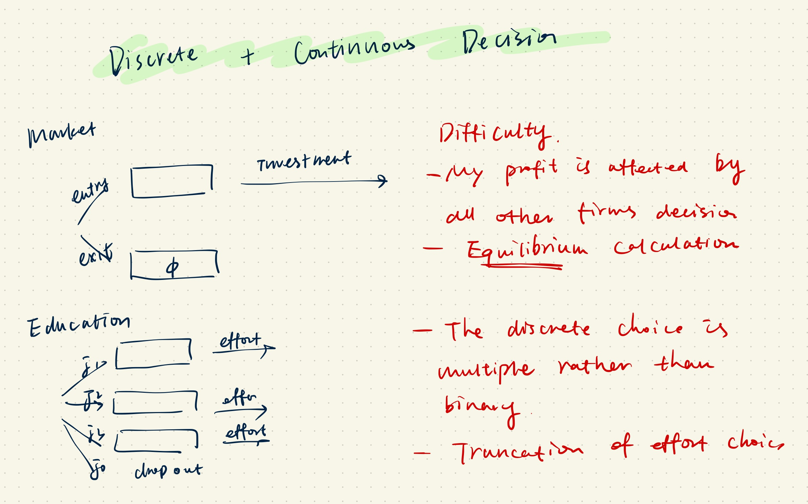

# Modeling the market evolution with oligopolistic competition

Firtly, this semester I took a course on Empirical IO. One of the assginments is to code **the multiagent model** proposed by Ericson and Pakes (1995). Though Chuqing (our lovely instructor) has already provided us with a set of skeleton codes (along with flesh:), I struggled a lot to make things work.

Now I just want to jot down some notes in case I need to revisit it some time in the futture.

Secondly, I read the (paper)[https://www.journals.uchicago.edu/doi/abs/10.1086/726702?journalCode=jole] by [Olivier](https://sites.google.com/view/olivierdegroote/homepage?authuser=0) on the **modeling of student's choice** in high school to study the policy on repeating grades or downgrading tracks. They are very similar in the combination of choices considered: 
1. discrete choice
   1. binary: entry/exit
   2. multinomial: choice of tracks
2. continuous choice
   1. investment in productivity
   2. effort in studying

## Multiagent 

### Backgound and Motivation
There are M players in the market, some are incumbents and some are potential entrants. In each period, they need to make the following decisions and moves: 
1. **Incumbent firms** choose whether to stay or exit. **PO** choose whether to enter or not. 
2. Staying firms and entering firms choose investment level 
3. Staying firms compete by setting quantities and receive current profits/flow utility.
4. Investment level realizes in the form of individual productivity shocks $\tau_i$. But total productivity $\omega_i$ is also affected by the aggregate productivity shock $\nu$. 
5. Now every one in the market (staying and entering) enters in the next period with a new productivity level $\omega_i'= \omega_i+ \tau_i - \nu$. W
6. The process repeats so that we can see a transition of the number of market players, the investment of each player, the productivity of each player etc. We call this, model-generated industry evolution/dynamics. We want the model generated dynamics to mathch the observed dynamics in the data/real world.

## Variables
- state variables: productivity $\omega$, which is a vector of the inidividual productivity $(\omega_1,\ldots,\omega_M)$. *We will simplify the representation of state later in computation.*
- choice variables: The choice is determined by **player's strategy/policy function** of the state variables.
  - We denote $d(\omega)$ to be the discrete choice.
  - We denote $x(\omega)$ the continuous investment choice.

## State transition
Individual productivity follows
$$\omega'=\omega+\tau_i-\nu.$$
- $\tau_i$ is the individual shock which depends on $x_i$. By the way, in practice we like the logistic function very much.
  - Binary: $p(x=1)=\frac{ax}{1+ax}$
  - Multinomial $x=1,\ldots, m$ : ordered logit $p()$
- $\nu$ is the aggregate shock.
  
## **Payoff (Value function)**
The payoff or to say the value function is a function of the state as well. It can be decomposed into a flow part (current payoff) and a continuation part (future payoff).
- We denote $\pi(\omega)$ the flow.
- We don't assign more symbols because there are already a lot of them:)
### Current payoff 
The current payoff is the outcome of a Cournot competition. 
For simplicity we specify a one-to-one mapping betweenn productivity $\omega_i$ and marginal cost $\theta_i$.
- The (inverse) demand is $p=D-\sum_i^N q_i$
- The supply is $q_i=p-\theta_i$
The equilibrium price and quantity is 
- price $p^*=\frac{D+\sum_{i=1}^N \theta_i}{N+1}$
- quantity $q^*=\frac{D+\sum_{i=1}^N \theta_i}{N+1}-\theta_i$
- profit $\pi_i*=(p^*-\theta_i)q^*_i-f-x_i$

### Continuation payoff
As the name suggests, this is the payoff if the agent continues (if incombent, stays. if potential entrant, enters.)
This is where things get a bit tricky because there are too many things that the player does not know when making decisions and thus need to take expectation of.

Let's enumerate what's **outside** the player's information set.
1. next period scrap value $\phi_i'$
2. next period all other firms $\omega_{-i}'$ 
3. aggregate shock $\nu$
4. individual shock $\tau_i$

We take expectation from 1 to 4. *The meaning of order will clear once I write it down*.
$$\E[V(\omega_i',\omega_{-i}',\phi')|(\omega_i, \omega_{-i}),d_i,x_i]=\int_{\tau_i} \int_\nu \int_{\omega_{-i}'} V(\omega_i+\tau_i-\nu, \omega_{-i}')dF(\omega_{-i}'|\omega_i,\omega_{-i},\nu)dF(\nu)dF(\tau_i|x_i).$$

Since we have make binary assumption on $\nu$ and $\tau_i$, we can simplify the integral in two steps.
- The inner two integrals
$$V(\omega_i', \omega_{-i}')=\int_\phi V(\omega_i',\omega_{-i}',\phi')$$

$$W(\tau_i,\omega_i,\omega_{-i})  =\Pr(\nu=1)\sum_{\omega_{-i}'}\Pr(\omega_{-i}'|\omega_i,\omega_{-i},\nu=1)V(\omega_i+\tau_i-1, \omega_{-i}')$$      
$$+\Pr(\nu=0)\sum_{\omega_{-i}'}\Pr(\omega_{-i}'|\omega_i,\omega_{-i},\nu=0)V(\omega_i+\tau_i, \omega_{-i}').$$

- The outer two integrals
$$\E[V(\omega_i',\omega_{-i}',\phi')|(\omega_i, \omega_{-i}),x_i]=\Pr(\tau_i=1|x_i)W(1, \omega_i,\omega_{-i})+ \Pr(\tau_i=0|x_i)W(0, \omega_i,\omega_{-i}).$$

Potential entrant has a very similar value function (but not the same!).

## Equilibrium 
What is equilibrium in this case? *It is always that something from one side is in accordance with the other side.*  

Here, we are saying that each decision maker's **belief on state transition** is in accordance with the **actual transition**. 

Therefore, the equilibrium here is **characterized by the following objects.**
1. The belief on other incumbents $F(\omega_{-i}'|\omega_i,\omega_{-i},\nu)$ and the actual $F(\omega'|\omega)$ 
2. The belief on potential entrant $p_e$ and the actual entry probability.

## Solution 
Solving for the equilibrium objects is equivalent to solving for the value functions and policy functions such that the **belief** used in calculating the value function and policy function is the same as what the value and policy function actually generates. 
**We can immediately see that this bode for contraction mapping theorem.**

We need to define a function operator $H: \mathcal{V}\to \mathcal{V}$. See  for the beautiful proof.

## Single-agent

In fact, I think the single-agent model albeit difficult is not as computationally demanding (parameter estimation) and mathematically demanding (proof of the existence of equilibrium) as the multi-agent one. But I want to make a comparison using the same subsectioning in the context of high school education. 

Although competition does exist among students, the sheer number of students clearly discourage me to think of modelling student's choice in a *oligopoly setting*.

## Variables
1. state variables: 
   1. time invariant $z_i$, 
   2. time varying end of year score $\omega_i$
2. choice variables: 
   1. $d_i$: which track and class to pick. There are 4 tracks and 2 class. 
   2. $x_i$: how much effor to spend. This is continuous. 

## State transition
Here we allow the score to change over time. The transition probability $\Pr(\omega'|\omega)$ depends on effort in a ordered logistc fucntion manner.

## Payoff (Value function)

### Flow utility 
In the multiagent framework, once the player has decided on entry/exit (discrete) the current payoff is determined solely by a fixed cost $-f$ and a marginal cost $-1\times x_i$ and the state.

Here, once the student has decided on the track and class (discrete) the current payoff is determined by a fixed cost $-C(d_i)$ and a marginal cost $-c(d_i)x_i$$ 
Taken together, we have 
$$u_d(x)=-C(d)-c(d)x$$

### Continuation utility

Let us see what is outside of the student information set. 
- the end of year score which affects the certificate he can get. The certificate will affect what he choose.

Therefore, the expectation is 
$$\E[V(\omega_i')|\omega,x_i]=$$

