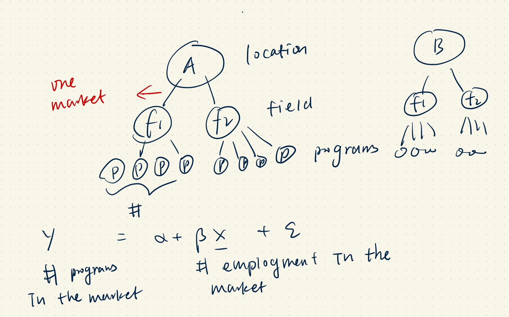

# Notes on Shift Share Instrument 

I read a paper on the supply of [Short Cycle Programs in Columbia](https://www.dropbox.com/s/4fzp71flvqanc2w/Colombia_SCPMarket.pdf?dl=0) today. The descriptives are interesting (e.g., the high turnover of these SCPs) and the empricial findings clear (e.g., private instituitions are more responsive). Though there is no structural model as is usually the case in nowadays IO papers on exit and entry (closing and opening of a program in this case). **I learned something from the empirical section, which is the shift share instrument.**

## Shift Share Instrument (aka Bartik Instrument)

Reference: [Kohei's slides](https://kohei-kawaguchi.github.io/AppliedEconometricsPublic/14_shift_share_design.html#1).

**Setting:** I draw the following figure to illustrate the market settings in the paper. 

**Question**: I want to know how employment in market $m_1$ affects the number of programs in market $m_1$. 

**Issue**: The shock to the opening/closing of programs is correlated with the employment in the same market as well.

**Solution**: 
Let us take one sector $s. We define the aggregate shock to a sector S to be $g_s$. 

*How is this shock affect each market $m$? Especially how does it affect employment in market each market?*

A market **aborbs** a share of the shock $g_s$. The share is given by 
$$ \frac{E_{m|s}}{\sum_{m'|s} E_{m'|s}}$$ 
Focusing on only one sector $s$, the employment in market $m$ over the employment in all markets.

Therefore, a market $m$ absorbs a share of the shock $g_s$ for all $s=1,2,...,S$.

In total, 
$$b_m = \sum_{s=1}^S \frac{E_{m|s}}{\sum_{m'|s} E_{m'|s}} g_s$$

We claim that this is an instrument that is uncorrelated with the error term either because
1. the share $p_{m|s}=\frac{E_{m|s}}{\sum_{m'|s} E_{m'|s}}$ is exogenous.
2. the shock $g_s$ is exogenous.

I think in this SCP paper, we assume that all the sector shock $g_s$ are exogenous (uncorrelated with the shock that affect the number of programs $m$).

For the first point, refer to [Paul Goldsmith et al, 2019](http://paulgp.com/papers/bartik_gpss.pdf).